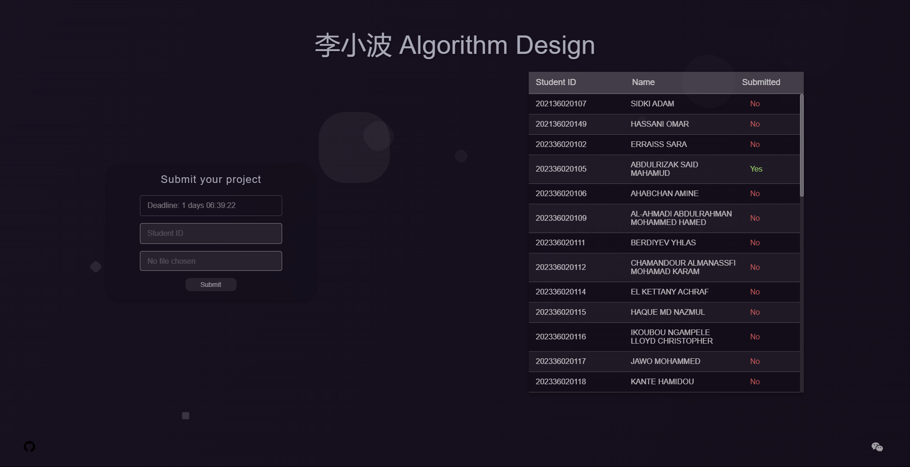

## About This Project

The **Submit Page** is a dynamic web application designed to manage student submissions efficiently. It enables users to submit files while validating file formats and sizes, and provides real-time progress updates. This project focuses on:

- **Seamless Form Validation**: Ensures that all form inputs are correctly filled out with feedback and error messages.
- **File Uploading**: Handles file uploads with smooth progress indicators, and supports various file types.
- **Responsive Design**: Built for usability across multiple devices, including mobile screens.

## Key Features

- **Auto-fill Functionality**: Automatically populates form fields with student data to streamline the submission process.
- **Background Animations**: Enhances user experience with floating cubes and modern design elements.
- **File Validation**: Supports multiple file formats and checks for size limits to ensure proper submission.
- **Laravel Framework**: Built using Laravel, offering powerful back-end capabilities and security.
- **Dynamic Table Management**: Displays and updates student submissions dynamically without page reloads.

## Screenshot

preview of the web page:

## Learning Resources

To get started with Laravel, check out its comprehensive [documentation](https://laravel.com/docs). You may also want to explore the following resources for additional learning:

- [Laravel Bootcamp](https://bootcamp.laravel.com)
- [Laracasts](https://laracasts.com)

For PHP, I learned from [Dani Krossing's YouTube series](https://www.youtube.com/playlist?list=PL0eyrZgxdwhwwQQZA79OzYwl5ewA7HQih).

## Security Vulnerabilities

If you discover a security vulnerability, please send an e-mail to Abdullah Al Raimi via [abdullah@syalux.com](mailto:abdullah@syalux.com). All security vulnerabilities will be promptly addressed.

- **Weixin JSSDK Integration**: Wechat doesn't think that my application is secure and has blocked it. If you have any solutions that do not require an official Weixin account, please contact me.

## Contributing

Contributions to this project are welcome! If you'd like to report an issue or submit a pull request, please visit our [contribution guide](https://github.com/Al-rimi/Submit-page/CONTRIBUTING.md).

## License

This project is licensed under the [MIT license](LICENSE).

